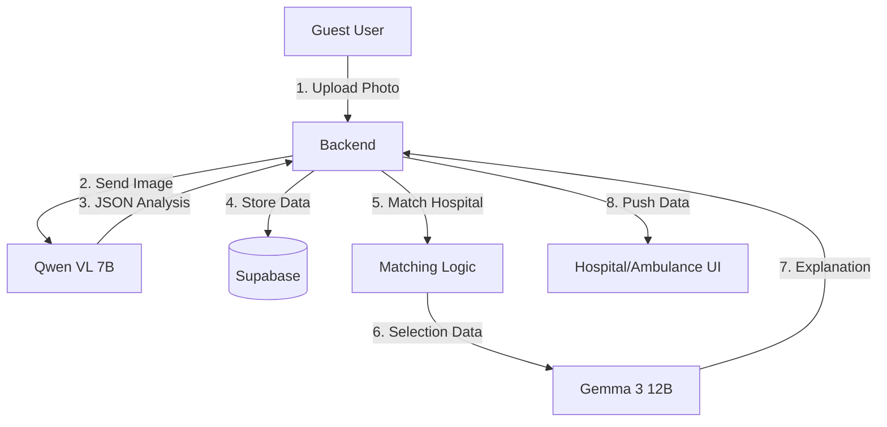

# AI & LLM Architecture Plan (Phase 6)

## 1. Overview
We will integrate a Dual-Model AI System to enhance the emergency response workflow.
*   **Vision Model (`qwen/qwen-2.5-vl-7b-instruct:free`)**: Analyzes accident photos from Guest Users to estimate severity, vehicle type, and potential number of casualties.
*   **Reasoning Model (`google/gemma-3-12b-it:free`)**: Provides "Explainable AI" for hospital routing decisions and generates medical triage advice for ambulances.

## 2. Architecture Diagram



## 3. Implementation Details

### A. Tech Stack
*   **Provider**: OpenRouter API
*   **Key**: `EXPO_PUBLIC_OPENROUTER_API_KEY` (Securely stored in Backend `.env`)
*   **Client**: `axios` or `openai` SDK (configured for OpenRouter base URL)

### B. Features & Flows

#### Feature 1: Automated Accident Analysis (Guest Flow)
*   **Input**: Image URL (from Supabase Storage).
*   **Model**: `qwen/qwen-2.5-vl-7b-instruct:free`
*   **Prompt**: "Analyze this accident scene. Estimate severity (1-10), number of vehicles, and potential injuries. Return JSON."
*   **Output JSON**:
    ```json
    {
      "severity": 8,
      "hazards": ["fuel_leak", "fire"],
      "vehicles": ["bus", "motorcycle"],
      "estimated_casualty_count": "3-5"
    }
    ```
*   **Usage**: Pre-fills the Ambulance "Casualty Form" and sets initial priority.

#### Feature 2: Optimization Explanation (Hospital Flow)
*   **Input**: JSON of Hospitals (distance, resources) + Matched Result.
*   **Model**: `google/gemma-3-12b-it:free`
*   **Prompt**: "Why was Bir Hospital chosen over Teaching Hospital for this trauma case? Explain briefly for a medical coordinator."
*   **Output**: "Bir Hospital was selected because it is 5 mins closer and has 2 available trauma surgeons, whereas Teaching Hospital is currently at full ICU capacity."

### C. Backend Structure

*   **`services/aiService.js`**: Core wrapper for OpenRouter API.
*   **`routes/ai.js`**: Endpoints (`POST /analyze-image`, `POST /explain-decision`).

## 4. Security & Safety (User Requirement)
*   **Deterministic Safety**: AI *never* overrides the hard-coded matching logic (Distance/Resources). It only *explains* or *augments* data.
*   **Privacy**: Images are processed transiently. No PII sent in prompts if possible.

## 5. Next Steps
1.  Setup `aiService.js`.
2.  Create `POST /api/ai/analyze` endpoint.
3.  Integrate "Analyze Photo" button in Guest UI (or auto-trigger on upload).
